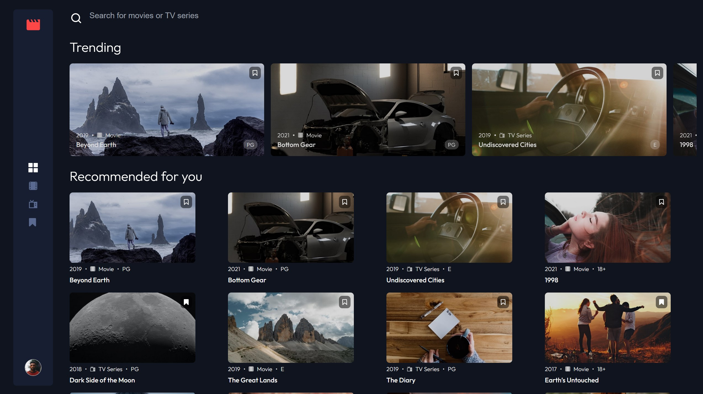

# Frontend Mentor - Entertainment web app solution

This is a solution to the [Entertainment web app challenge on Frontend Mentor](https://www.frontendmentor.io/challenges/entertainment-web-app-J-UhgAW1X). Frontend Mentor challenges help you improve your coding skills by building realistic project.

## Table of contents

- [Overview](#overview)
  - [The challenge](#the-challenge)
  - [Screenshot](#screenshot)
  - [Links](#links)
- [My process](#my-process)
  - [Built with](#built-with)
  - [What I learned](#what-i-learned)
  - [Continued development](#continued-development)
  - [Useful resources](#useful-resources)
- [Author](#author)

## Overview

### The challenge

Users should be able to:

- View the optimal layout for the app depending on their device's screen size
- See hover states for all interactive elements on the page
- Navigate between Home, Movies, TV Series, and Bookmarked Shows pages
- Add/Remove bookmarks from all movies and TV series
- Search for relevant shows on all pages
- **Bonus**: Build this project as a full-stack application
- **Bonus**: If you're building a full-stack app, we provide authentication screen (sign-up/login) designs if you'd like to create an auth flow

### Screenshot

### Links

- Solution URL: [Add solution URL here](https://your-solution-url.com)
- Live Site URL: [Entertainment App](https://mkshows.netlify.app/)

## My process

### Built with

- Semantic HTML5 markup
- Flexbox
- CSS Grid
- CSS modules
- Mobile-first workflow
- [React](https://reactjs.org/) - JS library
- Tailwind CSS
- [Firebase Auth](https://firebase.google.com/docs/auth) - Authentication provider
- [Cloud Firestore](https://firebase.google.com/docs/firestore) - Cloud storage
- [React Router](https://reactrouter.com/en/main) - Routing

### What I learned

- How to work with firebase auth to provide authentication service
- How to work with React Router and authentication to secure protected routes.

### Continued development

- Planning on implementing a TMDb API to fetch shows
- Continued development to make it a fullstack application.

### Useful resources

- [Firebase Auth](https://firebase.google.com/docs/auth) - This helped me learn how to use Firebase's authentication service.
- [Cloud Firestore](https://firebase.google.com/docs/firestore) - This helped me learn how to use Firebase's cloud storage. It allowed me to no longer local data in the app. Bookmarked data is no longer stored locally on the browser.
- [React Router](https://reactrouter.com/en/main) - Docs for React Router.

## Author

- Website - [Mtendere Kulemeka](https://www.devmk.netlify.app)
- Frontend Mentor - [@mkulemeka](https://www.frontendmentor.io/profile/mkulemeka)
- Twitter - [@kahle01](https://www.twitter.com/kahle01)
